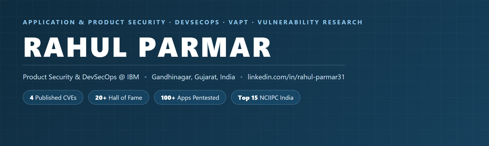

## 👋 About

Product security &amp; **DevSecOps** at **IBM** — secure-release reviews for IBM Maximo Application Suite, running SAST,
DAST, SCA and container scanning (Mend, OWASP ZAP, Twistlock) with hands-on remediation of open-source and container
findings. Before IBM I was the **founding security hire** at Zarca Interactive, where I built the security function from
nothing: the process, the tooling stack and a five-person team. Earlier, red-team and VAPT delivery at **PwC** across
banking, financial services and oil &amp; gas. On my own time I hunt bugs and report them responsibly.

---

## 🎯 Featured Project

### 🔬 [VoltVerse — Self-Hosted Cyber Range](https://github.com/ghostbit11/voltverse-lab)

> A cybersecurity training range that looks like a real SaaS product — **11 realistic target apps**,
> **48 hands-on challenges**, flags &amp; scoring, cross-app attack campaigns, a role-based admin console,
> and an auto-detecting **blue-team SOC**. One `docker compose up` and it runs.

Covers the **OWASP Web Top 10**, **API Top 10** and **LLM Top 10** — SQLi, XSS, SSRF, SSTI, IDOR/BOLA, JWT
`alg:none`, GraphQL abuse, OAuth `redirect_uri`, PHP object injection, prompt injection &amp; RAG poisoning — each
scalable across four difficulty levels from *textbook-vulnerable* to a *hardened reference fix*.

---

## 🧪 Security Research

**Published CVEs**

**🏆 Hall of Fame** — responsible disclosure
`Apple` · `United Nations` · `Dell` · `Deutsche Telekom` · `eBay` · `FitBit` · `HubSpot` · `Springer Nature` · `Inflectra` · `Electro Rent` · `Worldline Global` · `APNIC`

**📜 Letters of acknowledgement**
`Harvard University` · `Intuit` · `ESET` · `Avast` · `Huawei` · `Intel` · `HumanFirst`

**🥇 Recognition** — ranked among the **Top 15 researchers** for reporting vulnerabilities in Government of India
websites — NCIIPC India (a unit of NTRO), April 2021 newsletter.

**✍️ Writing** — *"Hashcat for Forensics"*, National Journal of Anti Cyber Crime Research &amp; Studies (ACCRS) ·
Google Dorks published on **Exploit-DB**.

---

## 🧰 Skills

| Area | Coverage |
|---|---|
| **Offensive** | VAPT · Web / API / Mobile Pentesting · Red &amp; Purple Teaming · Breach &amp; Attack Simulation · VPN Testing · OWASP Top 10 · JWT / OAuth / Rate-Limit Bypass |
| **Product Security / DevSecOps** | SAST · DAST · SCA · Container Scanning (Twistlock / Prisma Cloud) · Mend · OWASP ZAP · Secure SDLC · CI/CD Security · SBOM · OSS Remediation · Secure Release Review |
| **Vulnerability Management** | CVE Analysis · CVSS Scoring · PSIRT / PVR Workflows · Remediation Tracking · Executive Reporting |
| **Detection &amp; Response** | Threat Hunting · SIEM (Sentinel) · Defender for Endpoint · Sophos XDR · Azure WAF · Dark-Web Monitoring |
| **Cloud &amp; GRC** | AWS · Azure · Cloud Security Audits · ISO 27001 · SOC 2 · DPDP Act 2023 |

**Tooling**

---

## 🎖 Certifications

`ISO/IEC 27001 Lead Auditor` · `CEH v11 (EC-Council)` · `CCEP` · `CNSS (ICSI UK)` · `Autopsy` · `OSForensics Triage` · `DPDP Act 2023 — 96%`

---

Open to product security, application security, DevSecOps and VAPT roles.

